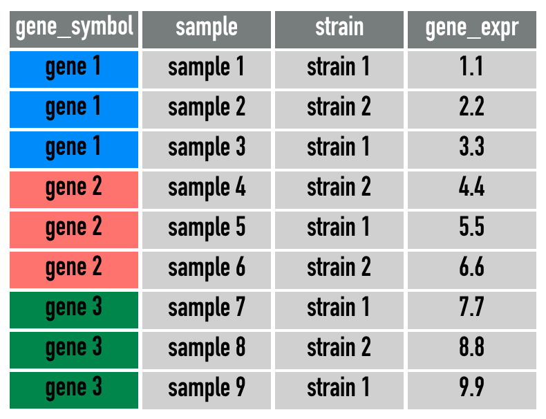
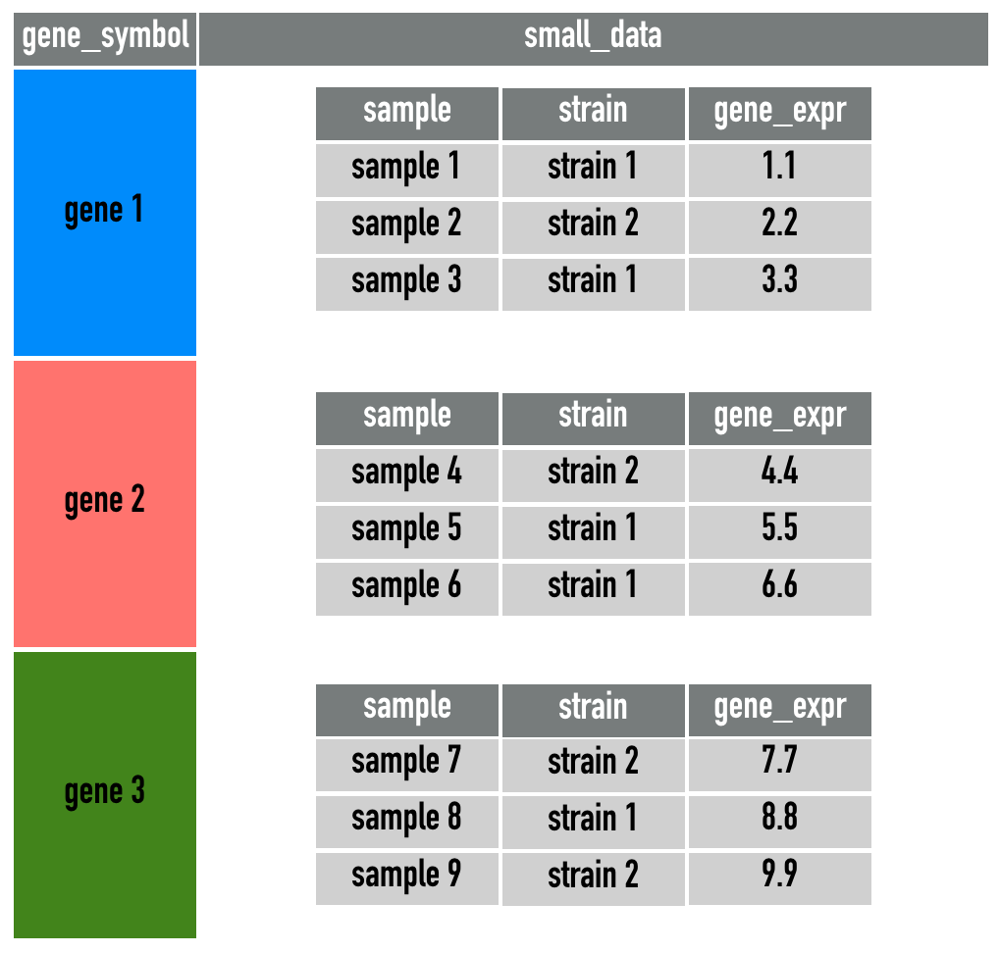
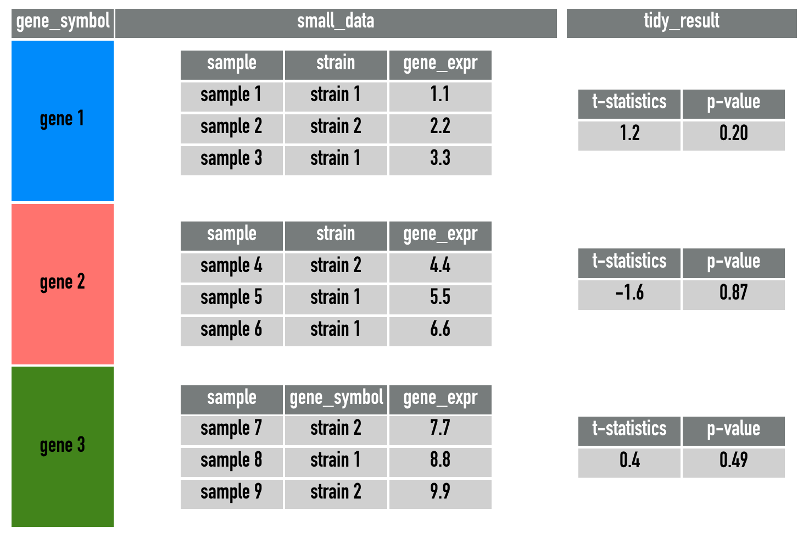

```{r setup, include=FALSE}
knitr::opts_chunk$set(results = "hide", warning = FALSE, message = FALSE)
```

# Learning outcomes of this session

+ Compute differential expression p-values using the `broom` and `purrr` packages
+ Make a boxplot of gene expression values with `ggplot2`

# Loading packages

```{r}
library(tidyverse)
```

# A quick word about `tibble`

Most of the time, you can think of a `tibble` as being identical to a `data.frame`. In fact, in Session 1 and 2, even though we keep referring to the data as `data.frame`, but they are actually `tiblle`s. `tibble` is the default alternative to `data.frame` in the `tidyverse`. 

The reason that `tibble` is so useful is that it allows for `list` objects as columns. This will come in very handy when performing modelling tasks. Have a look at the picture below: 


Suppose that we want to perform modelling within each `Species` of three different iris flowers, it would be much better to utilise this new structure of representation of data in the middle and apply the modelling for each element of the `Measurements` column. This is indeed what we will try to achieve in this session. 

# Loading cleaned sample data

The `session3_data.csv` data is almost identical to the `wide_sample_ge_data.csv` file that we just saved in Session 2. Except that we actually used all 54 genes [when reading in the downloaded data](./session2.html#reading_ge). We will take the logarithm of all the gene expression values for convenience. 

```{r}
session3_data = read_csv(file = "data/session3_data.csv") %>% 
  dplyr::select(-time, -dose)

clean_data = session3_data %>% 
  dplyr::mutate_if(.predicate = is.numeric, .funs = log) 

clean_data
```


# t-test

A typical task in bioinformatics is to perform differential gene expression analysis. That is, we want to identify genes that has a different expression levels between two conditions. While there are many ways that this can be done, we will opt for the simplest approach of using a t-test. 

In `R`, t-test can be performed using the `t.test` function. Below, we will perform a t-test on the Ahrrr gene between the two strains of mice. (Note: statistically speaking, this test is a bad idea due to the existence of different `dose` and `time` could creating confounding. However, since statistics is not the focus of this workshop so we will ignore this fact for now.)

```{r}
t.test(Ahrr ~ strain, data = clean_data)
```

The output of the `t.test` function can be a bit hard to read or manipulate into a data.frame. This is where the `tidy()` function from the `broom` package can help.

```{r}
t.test(Ahrr ~ strain, data = clean_data) %>% 
  broom::tidy()
```


Similarly, we can do the same for the Cxcr7 gene. 

```{r}
t.test(Cxcr7 ~ strain, data = clean_data) %>% 
  broom::tidy()
```


In the `clean_data`, we have 54 genes in total. If we want to perform t-test on each gene, should we type out 54 lines of code? The answer is no! This is not the most efficient way to utilise your time and there are fast ways to achieve the same outcome. However, we may need to take a quite diversion to understand loops and iterations. 

# `for` loops

`for` loops are common in any programming language. It simply list out the instructions and the iterations are specified using an index. For example, the following code prints out 1 to 5.

```{r}
for (i in 1:5){
  print(i)
}
```

We can use the `for` loop to go through each column in `clean_data`, calculate the t-test statistics and print them out. However, this output is often not plotting-friendly because we need to merge this output with the original gene expression values before any plotting can be done. We can use a `tidyverse` framework to achieve the same thing. 

```{r, eval = FALSE}
## This code was not executed
for(i in 3:56){
  t.test(clean_data %>% pull(i) ~ clean_data$strain) %>%
    broom::tidy() %>% 
    print()
}
```


# Nesting data

Now, let's think about the task of calculating a t-test for each gene. This may seem like a very difficult task, but we can identify its components to achieve simplifications and generalisations. 

First, we should run the `t.test` and the `broom::tidy` function on gene expression values for a selected gene. Then, we do exactly the same operation for another 53 genes. So the grand overall task is actually very repetitive and we are really just applying the following function to 54 datasets, where each dataset only contains one selected gene. 

```{r}
tidy_test = function(this_data){
  t.test(gene_expression ~ strain, data = this_data) %>% 
    broom::tidy()
}
```


So now, our very difficult task of performing 54 t-tests is simplified to spliting `clean_data` into 54 datasets, one for each gene. 

While there are many ways this can be done in `R`, we will use a `tidyverse` framework that has the advantage of readable codes and generalisability. 

First, let's pivot our data into a long format. 

```{r}
gene_long = clean_data %>%
  tidyr::pivot_longer(
    cols = -c("strain", "sample"),
    names_to = "gene_symbol",
    values_to = "gene_expression")

gene_long
```

A simplification of `gene_long` is this diagram: 



Then we will use the `group_by` function and then apply the `nest` function from the `tidyr` package. 

```{r}
gene_nest = gene_long %>% 
  group_by(gene_symbol) %>% 
  tidyr::nest(.key = "small_data") %>% 
  dplyr::ungroup()

gene_nest

gene_nest$small_data[1:2]
```


So, a lot of things happened here. Let's explain. 

You might remember the `group_by` function when we were trying to use the `summarise` function to calculate summary statistics in Session 1. This is exactly what we achieved with `gene_nest`, since the `gene_long` data with 8,316 rows is summarised into a smaller data.frame with 54 rows. The idea is that any reduction of number of rows can considered to be a summary of the long data.

In `gene_nest`, each gene only has "one row", but in the `small_data` column, each row of elment in the `small_data` column is a `data.frame` of size 154 rows and 3 columns (indicated by the `[154 x 3]`). The reason that we have 154 observations is because we have 154 samples (number rows of `clean_data`) to begin with. The reason that we have 3 columns is because these are all the columns that we didn't put into `group_by`. 

So why are we doing this complicated structure? This is because our original aim is to split the `gene_long` data into 54 smaller data, and we have in fact achived that here with the `small_data` column. 


A simplification of `small_data` is this diagram: 



Now, we simply need to apply the `tidy_test` function onto the `small_data` column in this `gene_nest` data.frame. Again, we could do that with a for loop, but the same difficult issue of visualisation still applies. 

```{r, eval = FALSE}
## This code is not executed.
for(i in 1:54){
  tidy_test(gene_nest$small_data[[i]])
}
```


# `map` function in `purrr`

The `map` function from the `purrr` package is a tremendously powerful function. In simply terms, it allows us to write a `for` loop is a very simple and readable way. 

```{r, eval = FALSE}
## This code is not executed
purrr::map(.x = gene_nest$small_data,
           .f = tidy_test)
```


Why is this code better than the `for` loop even though they achieved the same output? The biggest reason is that **we don't have to read and understand individual lines** inside the `for` loop. We simply need to know: 

+ `.x`, the input
+ `.f`, the function

Then the function `.f` will be applied onto every element of the `.x` input. 

Another reason why the `map` function is superior to a `for` loop is how easy it can work with the `mutate` function in `dplyr`. The following code can be read as: 

+ In the `gene_nest` data, we want to `mutate` (create) a new column
+ This new column will be called `tidy_result` and it is defined as mapping the `tidy_test` function to every element if the `small_data` column. 

```{r}
gene_test = gene_nest %>% 
  dplyr::mutate(
    tidy_result = purrr::map(
      .x = small_data,
      .f = tidy_test)
  )

gene_test
```


A simplification of `gene_test` is this diagram: 



This is a very powerful framework, because it allows us to create new statistics horizonally inside a `data.frame`, keeping track of the matching genes/observations. You may not experience this yourself, but one of the most common mistake in data analysis is the mis-matching of rows when combining datasets and statistics. The use of the `mutate` and `map` functions allows all intermediate steps to be stored as a column inside a data.frame, preventing any mis-matchings. 

# Plotting t-test results

The `tidy_result` column in `gene_test` is now a list of tibbles (think of them as data.frames). Each of these tibbles contains t-test statistic and p-value associated with each gene. 

We will now need to expand this column. The function we will use is `unnest` from the `tidyr` package. As you may already guessed, this function undoes the `nest` operation. In this case, we want to undo the `tidy_result` column only. 

```{r}
gene_test$tidy_result[1:2]

gene_test_long = gene_test %>% 
  tidyr::unnest(tidy_result)

gene_test_long
```

Armed with all the t-test statistics and p-values, we may want to perform some quick visualisations. 

```{r}
gene_test_long %>% 
  ggplot(aes(x = p.value)) +
  geom_histogram()
```

This histogram shows that we actually have about 1/3 of genes significantly differentially expressed (DE) between the two strains. This is usually a problem with gene expression analysis because if all t-test assumptions are met, the p-values should be uniformly distributed over the [0,1] interval. This inflation is could be attributed to normalisation issues with the data since we have only taken the most naive approach of taking the logarithm. Additionally, we should also note that this is a _targeted_ gene expression data where genes are typically selected due to differential patterns they showed in pilot studies. We will not commenton the biological implication of this histogram further, but proceed with another common analysis, which is to create boxplots of the top differentially expressed genes. 


## Boxplots of top differentially expressed genes

In this section, we will first extract the top 6 DE genes and make a boxplot for each of them between the two strains.

The following code allows us to subset the data.frame to the 6 genes with smallest p-values (i.e. most differentially expressed). However, we shouldn't forget that all the gene expression values are still stored in the `small_data` column. We need to apply the `unnest` operation to extract these values.

```{r}
gene_test_long %>% 
  dplyr::filter(rank(p.value) <= 6) 

boxplot_data = gene_test_long %>% 
  dplyr::filter(rank(p.value) <= 6) %>% 
  tidyr::unnest(small_data)

boxplot_data
```

And now, let's perform the final plotting! 

```{r}
boxplot_data %>% 
  ggplot(aes(x = strain, 
             y = gene_expression)) +
  geom_boxplot() +
  facet_wrap(~ gene_symbol, scales = "free")
```


We can also prettify the plots by creating a `label` column in the data, which combines the gene symbols and p-values. 

```{r}
boxplot_data %>% 
  dplyr::mutate(label = paste0(
    gene_symbol, ", p-value = ", signif(p.value, 2))) %>% 
  ggplot(aes(x = strain, 
             y = gene_expression)) +
  geom_boxplot() +
  facet_wrap(~ label, scales = "free") +
  labs(x = "Strains", 
       y = "Gene expression values")
```


Alternatively, the `ggpubr` package also offers some default graphics that are similar to `ggplot2`, though with a different syntax.

```{r, message=FALSE}
library(ggpubr)
```

```{r}
ggboxplot(
  data = boxplot_data,
  x = "strain", 
  y = "gene_expression",
  facet.by = "gene_symbol",
  scales = "free") +
  ggpubr::stat_compare_means()
```

# References

Wickham et al., (2019). Welcome to the tidyverse. Journal of Open Source Software, 4(43), 1686, https://doi.org/10.21105/joss.01686


# Session Info

```{r, results = "show"}
sessionInfo()
```


