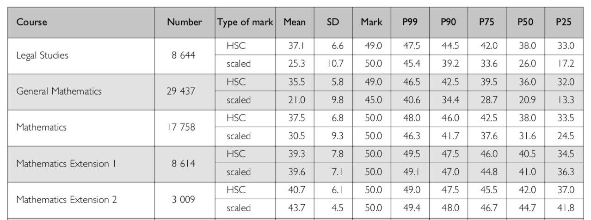
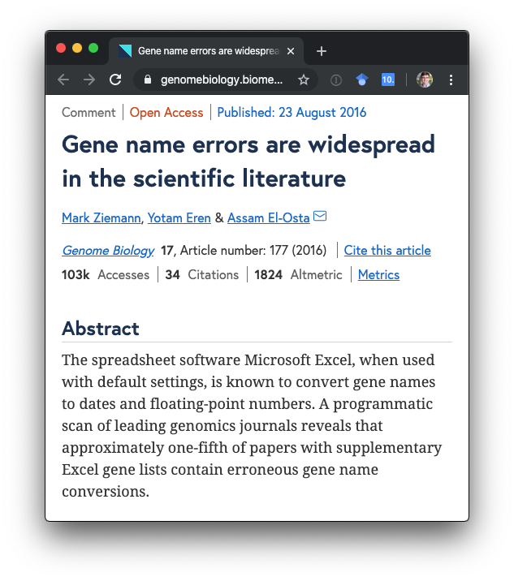

# Your instructors

+ Kevin: PhD candidate in statistics and bioinformatics. `r icon::fa("twitter")` `@KevinWang009`
+ Garth: Lecturer in statistics and data science. `r icon::fa("twitter")` `@garthtarr`

---

# Getting started with RStudio Cloud

We will use RStudio Cloud to run this workshop. 

1. Go to https://rstudio.cloud/, create an account and log in. 
2. Click the little arrow next to the "New Project" and select "New Project from Git Repo".
3. Enter "https://github.com/SydneyBioX/tidy2019" (it will download some things)
4. Give your project a name (a better name than Untitled Project).
5. Run this line of code `source("install.R")`  (this may take a few minutes to run, set it running then get involved in the icebreaker activity!)
6. If things seem to be running slowly after installing all the packages, just refresh the webpage.

_If you would prefer to run R and RStudio locally on your own machine:_

1. Open RStudio, File > New Project > Version Control > Git
2. In the repository URL field enter "https://github.com/SydneyBioX/tidy2019"
3. Click "Create Project"
4. Run this line of code `source("install.R")`

---

# Ice breaker: find someone who...

The aim of this "human bingo" activity is to meet a number of your peers, learn their names and find out something about them.

Directions: 

- Circulate around the room, collecting names from participants who meet the criterion listed in each box.
- You will have 5 minutes to try and fill in as many squares as you can with different names.
- You can have more than one name in each square and you can have the same name in many different squares.
- The "winner" is the first person who fills in (at least) one name in each box.

---

# Workshop outline: make a boxplot similar to [this](https://www.nature.com/articles/cmi2014102.pdf)

.pull-left-2[
<center>

</center>
]

--

.pull-right-1[

1. Get gene expression data
1. Get clinical data
1. Understand what the data structure
1. Figure out how to join the two data
1. Reshape the data
1. Visualisation
1. Compute t-test p-values and add them to the plots

]

.footnote[
Neve Polimeno, M., Ierano, C., D'Alterio, C., Simona Losito, N., Napolitano, M., Portella, L., ... Scala, S. (2015). CXCR4 expression affects overall survival of HCC patients whereas CXCR7 expression does not. _Cellular & molecular immunology_, 12(4), 474–482. [doi:10.1038/cmi.2014.102](https://www.nature.com/articles/cmi2014102.pdf)
]

---

# What is tidy data?

1. Each row is an observation unit
1. Each column is a variable 
1. Each cell is one value

```{r, include = FALSE}
library(tidyverse)
set.seed(123)
tidy_data = readr::read_csv("../data/clean_sample_data.csv")
```

```{r}
sample_n(tidy_data, size = 10)
```

---

# Why tidy data?

+ Because it will make our analyses and visualisation easier. 
+ An example of dirty data:

<center>

</center>

---

# Visualisation Gallery

+ NYC squirrel sighting: https://twitter.com/i/status/1189658282618699776
+ Australian election result: https://srkobakian.github.io/sugarbag/index.html

<center>

</center>

---

# A simple bioinformatics data

+ We will be working on a real gene expression data from [this article](https://rnajournal.cshlp.org/content/19/1/51.full): **Systematic evaluation of medium-throughput mRNA abundance platforms** by Prokopec et. al. 

+ The original data was generated to understand reproducibility of three gene expression technologies by comparing gene expression of mice treated with different diet. 

+ There are two pieces of data: 

1. **The sample data** was downloaded from the [journal's website](https://rnajournal.cshlp.org/content/19/1/51/suppl/DC1).

1. **The gene expression data** was downloaded from the [Gene Expression Omnibus](https://www.ncbi.nlm.nih.gov/geo/download/?acc=GSE43251&format=file&file=GSE43251%5FNanoString%5Fnon%2Dnormalized%2Etxt%2Egz), accession ID GSE43251.

We will play with the sample data on Monday, combine the two data for visualisation on Tuesday morning and perform basic modelling on Tuesday afternoon. 

---

# Challenges of this data

1. Understanding the data structure and read the two data into `R`.
1. Basic manipulation of the two data. 
1. Merging the two data. 
1. Visualising the data.
1. Reshaping the data for visualisation and modelling purpose.
1. Perform basic modelling on the data and extract insights.

---

# Session 1: reading data and basic manipulations

.pull-left[

> **Why can't I do everything in Excel?**

+ Processing raw data to meaningful scientific result is often complex and iterative. 

+ It is better and more rigorous to have a R-Markdown file documenting this process (reproducible).

+ In this session, we will learn how to read in the raw data, identify some problems with the data file, remove problemative rows and columns of the data and save a cleaned data file.

]

.pull-right[



]

.footnote[
Ziemann, M., Eren, Y. & El-Osta, A. (2016). Gene name errors are widespread in the scientific literature. _Genome Biology_ 17, 177 [doi:10.1186/s13059-016-1044-7](https://genomebiology.biomedcentral.com/articles/10.1186/s13059-016-1044-7)
]

---

# Pipe operator `%>%`

.large[

```
awesome_data =
  raw_interesting_data %>%
  mutate(somehow) %>%
  filter(the_good_parts) %>%
  summarise(required_statistics)
```

Instead of:

```
awesome_data = 
  summarise(
    filter(
      mutate(raw_interesting_data, somehow),
      the_good_parts),
    required_statistics)
```

]

.footnote[
Read more: https://r4ds.had.co.nz/pipes.html
]

---

# Extension exercises of Session 1

1. Load the `diamonds` data from `ggplot2`.  Find the number of observations for each cut. 
2. Calculate summary statistics of the price for each cut (e.g. mean, median, min, max, ...)

---
class: segue

# Session 2: `dplyr`, `tidyr` and `ggplot2`

---

# Session 2: visualisation with `ggplot2` 

+ `ggplot2` is rigorous framework for plotting
+ The `gg` in `ggplot2` stands for "grammar of graphics".
+ in order to produce a plot, a strict set of coding structure must be followed. 
+ In particular, **every characteristic of your plot is produced using one variable**. This avoids the "double y-axes" plot:
<center>

</center>

+ Other articles about bad visualisations can be found [here](https://venngage.com/blog/misleading-graphs/) and [here](https://www.businessinsider.com.au/the-27-worst-charts-of-all-time-2013-6?r=US&IR=T#i-never-thought-it-was-possible-but-i-actually-understand-soccer-less-after-looking-at-this-chart-3).

---

## A quick example of `ggplot2`

```{r, eval = FALSE, echo = FALSE}
library(dslabs)
data(divorce_margarine, package = "dslabs")

divorce_margarine_scaled = divorce_margarine %>% 
  dplyr::transmute(
    year,
    divorce = scale(divorce_rate_maine),
    margarine = scale(margarine_consumption_per_capita)
  )

readr::write_csv(divorce_margarine_scaled, path = "../data/divorce_margarine_scaled.csv")
```

```{r,include=FALSE}
divorce_margarine_scaled = read_csv("../data/divorce_margarine_scaled.csv")
```

.pull-left[
```{r}
divorce_margarine_scaled
```
]


.pull-right[
+ divorce should be mapped to the x-axis
+ margarine should be mapped to the y-axis
]
---

## First taste of `ggplot2`

```{r, fig.height=4}
divorce_margarine_scaled %>% 
  ggplot() #<<
```

---

## First taste of `ggplot2`

```{r, fig.height=4}
divorce_margarine_scaled %>% 
  ggplot(aes(
    x = divorce, #<<
    y = margarine #<<
  ))
```

---

## First taste of `ggplot2`

```{r, fig.height=4}
divorce_margarine_scaled %>% 
  ggplot(aes(
    x = divorce,
    y = margarine
  )) +
  geom_point() #<<
```

---

## First taste of `ggplot2`

```{r, fig.height=4}
divorce_margarine_scaled %>% 
  ggplot(aes(
    x = divorce,
    y = margarine,
    label = year #<<
  )) +
  geom_point() +
  geom_text() #<<
```

---

## First taste of `ggplot2`

```{r, fig.height=4}
divorce_margarine_scaled %>% 
  ggplot(aes(
    x = divorce,
    y = margarine,
    label = year
  )) +
  geom_point() +
  geom_text() +
  labs(title = "Divorce rate and margarine consumption") #<<
```

---

## Tidy is goal-dependent: treating each year as independent

```{r, fig.height=4}
divorce_margarine_scaled %>% 
  ggplot(aes(
    x = divorce,
    y = margarine,
    label = year
  )) +
  geom_point() +
  geom_text() +
  labs(title = "Divorce rate and margarine consumption")
```

---

## Can you make this plot using the data above?
.pull-left[

```{r}
divorce_margarine_scaled
```
]

.pull-right[
```{r, fig.height=6, echo = FALSE}
long_data = divorce_margarine_scaled %>%
  tidyr::pivot_longer(
    cols = -c("year"),
    names_to = "type",
    values_to = "values")

long_data %>% 
  ggplot(aes(x = year,
             y = values,
             colour = type)) +
  geom_point() +
  geom_path() +
  labs(title = "Can you make this plot using the data above")
```
]

---
## Pivot

<center>

</center>

---
class: segue

# Session 3: modelling with `tidyverse`

---

# t-tests

---

# Final remarks

## Where to go for further help

