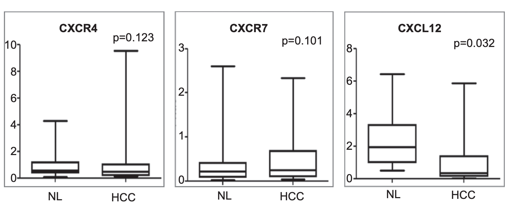

# Your instructors

+ Kevin: PhD candidate in statistics and bioinformatics. The minion of Garth. 
+ Garth: Senior lecturer in statistics. 

---

# Ice breaker

Ask Garth about this. 

---

# Workshop outline

+ We want you to make a boxplot similar to [this](https://www.nature.com/articles/cmi2014102.pdf)


<center>

</center>

1. Get gene expression data
1. Get clinical data
1. Understand what the data structure
1. Figure out how to join the two data
1. Reshape the data
1. Visualisation

---

# What is tidy data?

1. Each row is an observation unit
1. Each column is a variable 
1. Each cell is one value

```{r, include = FALSE}
library(tidyverse)
set.seed(123)
tidy_data = readr::read_csv("../data/clean_sample_data.csv")
```

```{r}
sample_n(tidy_data, size = 10)
```

---

# Why tidy data?

+ Because it will make our analyses and visualisation easier.


---

# Visualisation Gallery

+ https://twitter.com/50_first_data/status/1189658282618699776

+ Some code that you can run to make a cool plot

---

# A simple bioinformatics data

+ We will be working on a real gene expression data from [this article](https://rnajournal.cshlp.org/content/19/1/51.full). 

+ The original data was generated to answer a biological question of mice diet and also the reproducibility of three gene expression technologies.  

+ There are two pieces of data: 

1. **The sample data** was downloaded from the [journal's website](https://rnajournal.cshlp.org/content/19/1/51/suppl/DC1).
1. **The gene expression data** was downloaded from the [Gene Expression Omnibus](https://www.ncbi.nlm.nih.gov/geo/download/?acc=GSE43251&format=file&file=GSE43251%5FNanoString%5Fnon%2Dnormalized%2Etxt%2Egz), accession ID GSE43251.

---

# Challenges of this data

1. Understanding the data structure and read the two data into `R`.
1. Basic manipulation of the two data. 
1. Merging the two data. 
1. Visualising the data.
1. Reshaping the data for visualisation and modelling purpose.
1. Perform basic modelling on the data and extract insights.


---

# Session 1: reading data and basic manipulations

---

# Session 2: visualisation with `ggplot2` 

+ A rigorous framework for plotting

---

## Tidy is goal-dependent: treating each year as independent

```{r, eval = FALSE, echo = FALSE}
library(dslabs)
data(divorce_margarine, package = "dslabs")

divorce_margarine_scaled = divorce_margarine %>% 
  dplyr::transmute(
    year,
    divorce = scale(divorce_rate_maine),
    margarine = scale(margarine_consumption_per_capita)
  )

readr::write_csv(divorce_margarine_scaled, path = "../data/divorce_margarine_scaled.csv")
```

```{r,include=FALSE}
divorce_margarine_scaled = read_csv("../data/divorce_margarine_scaled.csv")
```


```{r, fig.height=4}
divorce_margarine_scaled %>% 
  ggplot(aes(
    x = divorce,
    y = margarine,
    label = year)) +
  geom_point() +
  geom_text() +
  labs(title = "Divorce rate and margarine consumption")
```

+ divorce is mapped to the x-axis
+ margarine is mapped to the y-axis
+ year is mapped to the labelling on scatter plot
+ Put points on plot
+ Put text on plot

---

## Tidy is goal-dependent: treating each year as time

```{r, fig.height=4}
divorce_margarine_scaled %>%
  tidyr::pivot_longer(
    cols = -c("year"),
    names_to = "type",
    values_to = "values") %>%
  ggplot(aes(x = year,
             y = values,
             colour = type)) +
  geom_point() +
  geom_path() +
  labs(title = "Divorce rate and margarine consumption")
```


+ year is mapped to the x-axis
+ values is mapped to the y-axis
+ type is mapped to the colouring of plot
+ Put points on plot
+ Put path
---

# Session 3: modelling with `tidyverse`

---

# Final remarks